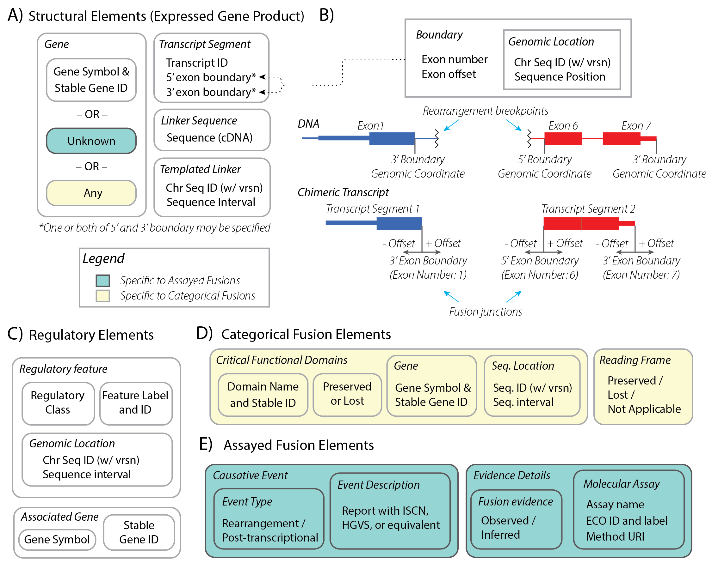

Minimum Information Model
!!!!!!!!!!!!!!!!!!!!!!!!!

   The minimal information for characterizing gene fusions is context-dependent, with components necessary for representing assayed fusions (blue-green boxes), categorical fusions (yellow boxes), or both (white boxes). **(A)** Structural Elements represent the expressed gene product, and are typically characterized at the gene level or the transcript level. Segments of transcripts should be represented by a transcript ID and associated 5’ and/or 3’ exon boundaries. **(B)** Exon Boundaries are characterized by the exon number and offset from the corresponding 5’ or 3’ end. Boundaries also include an aligned Genomic Coordinate with a versioned reference sequence identifier (e.g. a RefSeq NC\_ chromosome sequence accession) and position for data fidelity. Importantly, boundary Genomic Coordinates represent aligned Exon Boundary position, and NOT breakpoints for an associated rearrangement. **(C)** Regulatory Elements are represented minimally by the associated gene and information characterizing the regulatory element class (e.g. enhancer, promoter, or other INSDC regulatory class). If the specific regulatory element is known, the identifier for the regulatory element (e.g. RefSeq NG\_ accession) and associated genomic coordinates should also be provided. **(D)** Categorical fusions are additionally described by functional domains gained or lost by a fusion partner that are critical to fusion transcript activity, as well as if the fusion transcript reading frame should be preserved. **(E)** Assayed fusions are additionally described by the underlying causative event (if known) driving a fusion, as well as details about the molecular assay and whether the fusion was directly observed or inferred. The Evidence and Conclusion Ontology (ECO) provides a standardized set of terms for describing types of assays.