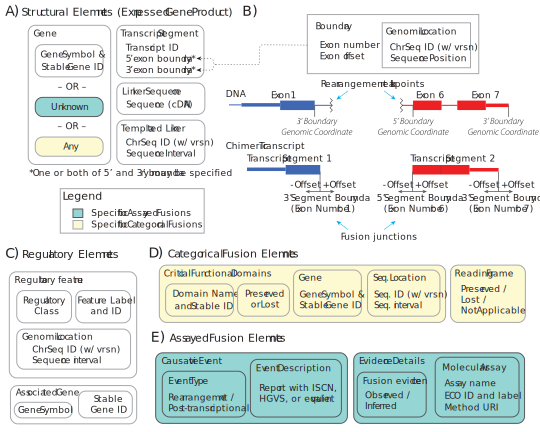

Minimum Information Model
!!!!!!!!!!!!!!!!!!!!!!!!!

   The minimal information for characterizing gene fusions is context-dependent, with components necessary for representing assayed fusions (blue-green boxes), categorical fusions (yellow boxes), or both (white boxes). **(A)** Structural Elements represent the expressed gene product, and are typically characterized at the gene level or the transcript level. Segments of transcripts should be represented by a transcript ID and associated 5’ and/or 3’ exon boundaries. **(B)** Exon Boundaries are characterized by the exon number and offset from the corresponding 5’ or 3’ end. Boundaries also include an aligned Genomic Coordinate with a versioned reference sequence identifier (e.g. a RefSeq NC\_ chromosome sequence accession) and position for data fidelity. Importantly, boundary Genomic Coordinates represent aligned Exon Boundary position, and NOT breakpoints for an associated rearrangement. **(C)** Regulatory Elements are represented minimally by the associated gene and information characterizing the regulatory element class (e.g. enhancer, promoter, or other `INSDC regulatory class`_). If the specific regulatory element is known, the identifier for the regulatory element (e.g. RefSeq NG\_ accession) and associated genomic coordinates should also be provided. **(D)** Categorical fusions are additionally described by functional domains gained or lost by a fusion partner that are critical to fusion transcript activity, as well as if the fusion transcript reading frame should be preserved. **(E)** Assayed fusions are additionally described by the underlying causative event (if known) driving a fusion, as well as details about the molecular assay and whether the fusion was directly observed or inferred. The Evidence and Conclusion Ontology (ECO) provides a standardized set of terms for describing types of assays.

.. _common-elements:

Common Elements
@@@@@@@@@@@@@@@

Some entities are common elements (e.g. :ref:`genes <gene-elements>`) are complex entities with their own information model and are reused across multiple sections of the gene fusion information model. The information models for those elements are described here.

.. _gene-elements:

Gene
####

A gene is defined by a gene symbol and stable gene identifier. For describing gene fusions in humans, we recommend using HUGO Gene Nomenclature Committee (HGNC) genes.

.. list-table::
   :class: clean-wrap
   :header-rows: 1
   :align: left
   :widths: auto

   * - Field
     - Limits
     - Description
   * - Gene symbol
     - 1..1
     - A registered symbol for a gene, e.g. ``ABL1``.
   * - Gene identifier
     - 1..1
     - A registered identifier for a gene, e.g. ``hgnc:76``.

.. _genomic-location:

Genomic Location
################

A genomic location is defined by a chromosomal reference sequence, a start coordinate, and an end coordinate.
Reference sequences should be versioned and associated with a genome assembly. In gene fusions, these are often used to
represent the inter-residue location at which a fusion junction occurs. They may also be used to specify the location of
regulatory elements or templated linker sequence.

.. list-table::
   :class: clean-wrap
   :header-rows: 1
   :align: left
   :widths: auto

   * - Field
     - Limits
     - Description
   * - Reference sequence identifier
     - 1..1
     - A registered identifier for the reference sequence, e.g. ``NC_000001.11`` for chr1 on GRCh38.p14.
   * - Start coordinate
     - 1..1
     - A coordinate representing the start of a genomic location.
   * - End coordinate
     - 1..1
     - A coordinate representing the end of a genomic location.

.. _structural-elements:

Structural Elements
@@@@@@@@@@@@@@@@@@@

.. todo:: structural elements section
