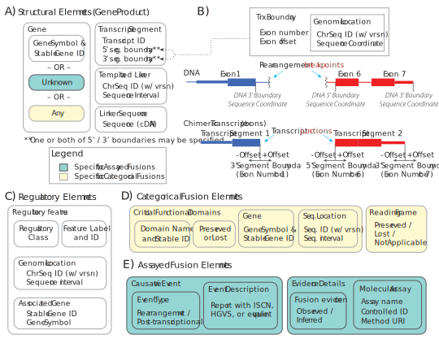

Minimum Information Model
!!!!!!!!!!!!!!!!!!!!!!!!!
To accurately characterize gene fusions, a set of data elements comprising a minimum information model has been defined.
These elements are selectively used in accordance with the type of gene fusion (:ref:`chimeric-fusions` and/or
:ref:`regulatory-fusions`) and the gene fusion context (:ref:`assayed-fusions` or :ref:`categorical-fusions`).

..
   **(E)** Assayed fusions are additionally described by the underlying causative event (if known) driving a fusion, as well as details about the molecular assay and whether the fusion was directly observed or inferred.

.. _common-elements:

Common Elements
@@@@@@@@@@@@@@@
Some data elements (e.g. :ref:`genes <gene-element>`) are complex entities with their own information model that are reused
across multiple sections of the gene fusion information model. We call these `common data elements`, which we describe here.

.. _gene-element:

Gene
####
A gene is defined by a gene symbol and stable gene identifier. For describing gene fusions in humans, we recommend using HUGO Gene Nomenclature Committee (HGNC) genes.

.. list-table::
   :class: clean-wrap
   :header-rows: 1
   :align: left
   :widths: auto

   * - Field
     - Limits
     - Description
   * - Gene symbol
     - 1..1
     - A registered symbol for a gene, e.g. ``ABL1``.
   * - Gene identifier
     - 1..1
     - A registered identifier for a gene, e.g. ``hgnc:76``.

.. _genomic-location:

Genomic Location
################
Formally, a genomic location is a specialized case of a :ref:`sequence-location`, with the reference sequence identifier
constrained to those representing chromosomal reference sequences associated with a genome assembly. A Genomic Location
may be informally described as a position on a chromosome sequence. In gene fusions, genomic locations are often used to
represent the inter-residue location at which a fusion junction occurs. They may also be used to specify the location of
regulatory elements or templated linker sequence.

.. _sequence-location:

Sequence Location
#################
A sequence location is a position on a sequence, defined by a reference sequence, a start coordinate, and an end
coordinate. Reference sequences used to describe Sequence Locations should be versioned.

.. note:: The coordinates indicated here are not described inherently as residue or inter-residue, 0-based or 1-based.
          Omission on this point is intentional, see the `associated Discussion at GitHub
          <https://github.com/cancervariants/fusions/discussions/17>`_.

.. list-table::
   :class: clean-wrap
   :header-rows: 1
   :align: left
   :widths: auto

   * - Field
     - Limits
     - Description
   * - Reference sequence identifier
     - 1..1
     - A registered identifier for the reference sequence, e.g. ``NC_000001.11`` for chr1 on GRCh38.p14.
   * - Start coordinate
     - 1..1
     - A coordinate representing the start of a genomic location.
   * - End coordinate
     - 1..1
     - A coordinate representing the end of a genomic location.

.. _reading-frame:

Reading Frame
#############
A common attribute of a gene fusion is whether the reading frame is preserved in the expressed gene
product (for categorical fusions) or whether it is predicted to be preserved based on assayed
findings (for assayed fusions). This is typical of protein-coding gene fusions.

.. list-table::
   :class: clean-wrap
   :header-rows: 1
   :align: left
   :widths: auto

   * - Field
     - Limits
     - Description
   * - Reading frame preserved
     - 0..1
     - Boolean indicating whether the reading frame must be preserved, or is predicted to be preserved.

.. _structural-elements:

Structural Elements
@@@@@@@@@@@@@@@@@@@
The structural elements of a gene fusion represent the expressed gene product, and are typically characterized at the gene
level or the transcript level. :ref:`chimeric-fusions` must be represented by at least two structural elements, and
:ref:`regulatory-fusions` must be represented by at least one structural element and one :ref:`Regulatory Element <regulatory-elements>`.

The order of structural elements is important, and by convention representations of structural components for gene
fusions follow a 5' -> 3' ordering. If describing a regulatory fusion, the regulatory element is listed first.

   The minimal information for characterizing gene fusions is context-dependent, with components necessary for representing assayed fusions (blue-green boxes), categorical fusions (yellow boxes), or both (white boxes). **(A)** Structural Elements represent the expressed gene product, and are typically characterized at the gene level or the transcript level. Segments of transcripts should be represented by a transcript ID and associated 5’ and/or 3’ :ref:`boundary`. **(B)** Segment Boundaries are characterized by the exon number and offset from the corresponding 5’ or 3’ end. Segment Boundaries also include an aligned Genomic Coordinate with a versioned reference sequence identifier (e.g. a RefSeq NC\_ chromosome sequence accession) and position for data fidelity. Importantly, segment boundary Genomic Coordinates represent the aligned positions of fusion junctions, and NOT breakpoints for an associated rearrangement.

Gene (as Structural Element)
############################

A gene (see the :ref:`gene-element` common element above for information model) may be used as a structural element, in
which case it refers to an unspecified transcript of that gene. For :ref:`categorical-fusions`, this means any
transcript meeting other parameters of the specified fusion. For :ref:`assayed-fusions`, this means that the exact
transcript is not known.

.. _transcript-segment-element:

Transcript Segment
##################

A transcript segment is a segment of transcribed sequence denoted by a 5' and 3' segment boundary.
Typically, transcript segments are used when the gene fusion junction boundary is known or when representing full-length
:ref:`chimeric-fusions`. In the case where only the fusion junction is reported, only one boundary of a given transcript
segment will be represented.

We recommend that *representative* transcript sequences, when needed, are preferentially selected using the following
criteria:

   1. A compatible transcript from MANE Select
   2. A compatible transcript from MANE Plus Clinical
   3. The longest compatible transcript cDNA sequence
   4. The first-published transcript among those transcripts meeting criterion #3

Transcript compatibility should be determined from what is known about the gene fusion structure. If the gene fusion
junction sequence is known, compatible transcripts are those that most accurately reflect the junction, with selection
among those transcripts prioritized by the above criteria. If the breakends for an underlying rearrangement are known,
those data may also help identify the most compatible transcript selection.

.. list-table::
   :class: clean-wrap
   :header-rows: 1
   :align: left
   :widths: auto

   * - Field
     - Limits
     - Description
   * - Transcript sequence identifier
     - 1..1
     - A registered identifier for the reference transcript sequence, e.g. ``NM_005157.6`` as a MANE Select transcript
       identifier for the ABL1 gene.
   * - 5' segment boundary
     - 0..1
     - A :ref:`boundary` representing the 5' end of the transcript segment
   * - 3' segment boundary
     - 0..1
     - A :ref:`boundary` representing the 3' end of the transcript segment

.. _boundary:

Segment Boundary
$$$$$$$$$$$$$$$$
A segment boundary describes the exon-anchored coordinate (and corresponding genomic coordinate)
defining a boundary of a transcript segment.

.. list-table::
   :class: clean-wrap
   :header-rows: 1
   :align: left
   :widths: auto

   * - Field
     - Limits
     - Description
   * - Exon number
     - 1..1
     - The exon number counted from the 5' end of the transcript.
   * - Exon offset
     - 1..1
     - A value representing the offset from the segment boundary, with negative values offset
       towards the 5' end of the transcript and positive values offset towards the 3'
       end of the transcript. Offsets can reference sequence in the intronic space.
   * - Genomic location
     - 1..1
     - A :ref:`genomic-location` aligned to the transcript segment boundary.

.. _linker-sequence:

Linker Sequence
###############
A linker sequence is an observed sequence in the gene fusion that typically occurs between
transcript segments, and where the sequence origin is unknown or ambiguous. In cases where
the linker sequence is a known intronic or intergenic region, it should be represented as a
:ref:`templated-linker` instead.

.. list-table::
   :class: clean-wrap
   :header-rows: 1
   :align: left
   :widths: auto

   * - Field
     - Limits
     - Description
   * - Sequence
     - 1..1
     - A literal sequence expressed as cDNA.

.. _templated-linker:

Templated Linker Sequence
#########################
A templated linker sequence is an observed sequence in the gene fusion that typically occurs
between transcript segments, and where the sequence origin is a known intronic or intergenic region.

.. list-table::
   :class: clean-wrap
   :header-rows: 1
   :align: left
   :widths: auto

   * - Field
     - Limits
     - Description
   * - Genomic location
     - 1..1
     - A :ref:`genomic-location` from which the linker sequence is derived.
   * - Genomic strand
     - 1..1
     - MUST be one of ``+`` or ``-``. Used to indicate the coding strand at the genomic location from which the
       linker sequence is derived,
   * - Sequence
     - 0..1
     - An optional literal sequence derived from the genomic location.

.. _regulatory-elements:

Regulatory Elements
@@@@@@@@@@@@@@@@@@@
Regulatory elements include a :ref:`regulatory-feature` used to describe an enhancer, promoter, or other regulatory
elements that constitute :ref:`regulatory-fusions`. Regulatory features may also be defined by a gene with
which the feature is associated (e.g. an IGH-associated enhancer element).

.. _regulatory-feature:

Regulatory Feature
##################
Our definitions of regulatory features follows the definitions provided by the
`INSDC regulatory class vocabulary`_. In gene fusions, these are typically either ``enhancer``
or ``promoter`` features. These features may be represented as stand-alone entities with their own conceptual identifier
(e.g. ENCODE cis-Regulatory Elements) or by a :ref:`genomic-location`. Regulatory features may also be represented by
their association with a nearby gene (e.g. regulatory fusion between MYC and IGH-associated enhancer elements).

It is expected that a regulatory feature will be described by at least (and often exactly) one of a ``Feature ID``,
``Genomic location``, or ``associated gene``.

.. list-table::
   :class: clean-wrap
   :header-rows: 1
   :align: left
   :widths: auto

   * - Field
     - Limits
     - Description
   * - Regulatory class
     - 1..1
     - MUST be ``enhancer``, ``promoter``, or another term from the `INSDC regulatory class vocabulary`_.
   * - Feature ID
     - 0..1
     - An optional identifier for the regulatory feature, e.g. `registered cis-regulatory elements from ENCODE`_.
   * - Feature location
     - 0..1
     - An optional :ref:`genomic-location` for the regulatory feature.
   * - Associated gene
     - 0..1
     - A :ref:`gene-element` associated with the regulatory feature.

Categorical elements
@@@@@@@@@@@@@@@@@@@@
Categorical data elements are specifically used for the representation of :ref:`categorical-fusions`. These data elements
define the key criteria for matching :ref:`assayed-fusions`.

Functional Domains
##################
Categorical Gene Fusions are often characterized by the presence or absence of critical functional domains within a
gene fusion.

.. list-table::
   :class: clean-wrap
   :header-rows: 1
   :align: left
   :widths: auto

   * - Field
     - Limits
     - Description
   * - Label
     - 0..1
     - An optional name for the functional domain, e.g. ``Protein kinase domain``.
   * - ID
     - 0..1
     - An optional namespaced identifier for the domain, e.g. `interpro:IPR000719 <https://identifiers.org/interpro:IPR000719>`_.
   * - Sequence location
     - 0..1
     - An optional :ref:`sequence-location` for the domain.
   * - Status
     - 1..1
     - MUST be one of [``preserved``, ``lost``]
   * - Associated gene
     - 1..1
     - The :ref:`gene-element` associated with the domain.

Assayed Elements
@@@@@@@@@@@@@@@@
Assayed data elements are specifically used for the representation of :ref:`assayed-fusions`. These data elements
provide important context for downstream evaluation of :ref:`chimeric-fusions` and :ref:`regulatory-fusions` detected
by biomedical assays.

Causative Event
###############
The evaluation of a fusion may be influenced by the underlying mechanism that generated the fusion. Often this will be
a DNA rearrangement, but it could also be a read-through or trans-splicing event.

.. list-table::
   :class: clean-wrap
   :header-rows: 1
   :align: left
   :widths: auto

   * - Field
     - Limits
     - Description
   * - Type
     - 1..1
     - The type of event that generated the fusion. May be ``rearrangement``, ``read-through``, or ``trans-splicing``.
   * - Description
     - 0..1
     - For rearrangements, this field is useful for characterizing the rearrangement. This could be a string describing
       the rearrangement with an appropriate nomenclature (e.g. ISCN or HGVS), or an equivalent data structure.

Assay
#####
Metadata about the assay that detected the fusion–and whether that fusion was directly detected by the assay or
inferred–is useful to preserve for downstream evaluation.

.. list-table::
   :class: clean-wrap
   :header-rows: 1
   :align: left
   :widths: auto

   * - Field
     - Limits
     - Description
   * - Name
     - 1..1
     - A human-readable name for the assay. Should match the label for the assay ID, e.g.
       ``fluorescence in-situ hybridization assay`` for `obi:OBI_0003094`_.
   * - ID
     - 1..1
     - An ID for the assay concept, e.g. `obi:OBI_0003094`_ from the `Ontology for Biomedical
       Investigations <http://obi-ontology.org/>`_.
   * - Fusion detection
     - 1..1
     - MUST be one of [`direct`, `inferred`]. Direct detection methods (e.g. RNA-seq, RT-PCR) directly interrogate
       chimeric transcript junctions. Inferred detection methods (e.g. WGS, FISH) infer the existence of a fusion in the
       presence of compatible biomarkers (e.g. ALK rearrangements in non-small cell lung cancers).
   * - Method URI
     - 1..1
     - A URI pointing to the methodological details of the assay.

.. _obi:OBI_0003094: https://identifiers.org/obi:OBI_0003094
