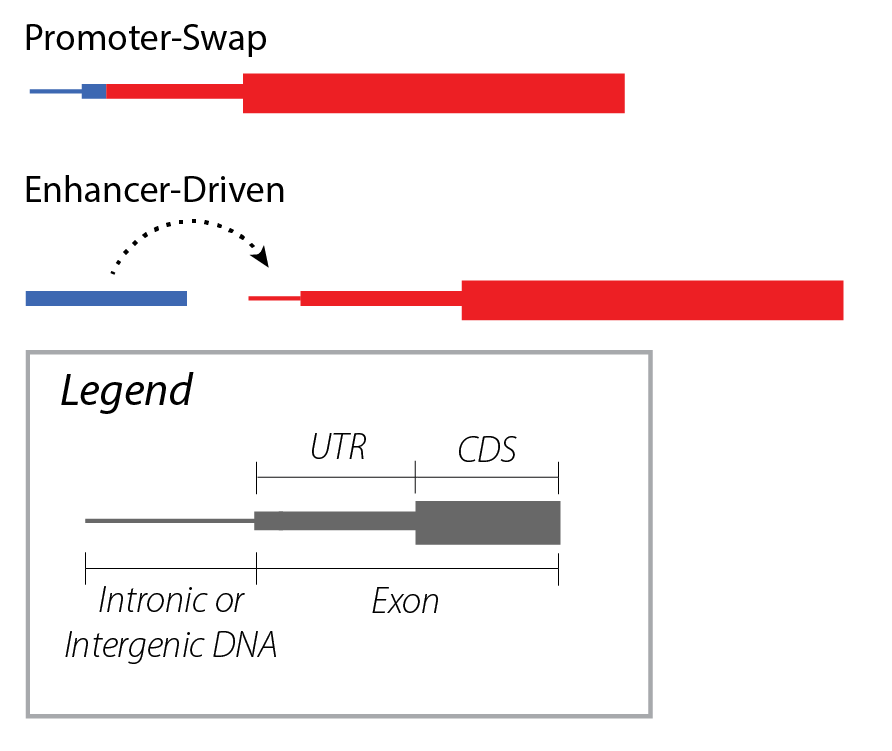

Terminology
!!!!!!!!!!!

.. _gene-fusions:

Gene Fusions
@@@@@@@@@@@@
Gene fusions are a complex class of genomic variation that may be characterized by a broad range of relevant attributes with varying specificity. **The defining characteristic of gene fusions is the interaction of two or more genes to drive aberrant activity of a gene product, through formation of a chimeric transcript or interaction of rearranged gene regulatory elements**. Similar genetic variations involving :ref:`rearrangements` within the same gene (e.g. internal tandem duplications), and transcript alterations due to splice site variants are biologically meaningful but distinct from gene fusions. Importantly, gene fusions are also distinct from the underlying genomic rearrangements that drive them, though these concepts have been conflated due to the historical use of genomic assays for inferring the presence of specific gene fusions.

The two primary classes of gene fusions–:ref:`chimeric-fusions` and :ref:`regulatory-fusions`–are not mutually exclusive classes, as some fusions (such as promoter-swap fusions) may be defined either in the context of their regulatory elements or by their chimeric gene product.

Gene products that are considered loss-of-function or are not expressed should not be described as gene fusions, even when they result from a genomic rearrangement.

.. _chimeric-fusions:

Chimeric Transcript Fusions
###########################
Chimeric transcript gene fusions are often driven by genomic rearrangements involving two gene loci, resulting in the concatenation of exons from each into a single chimeric transcript. This class of fusions is exemplified by well-known clinically-relevant gene fusions such as BCR(hgnc:1014)::ABL1(hgnc:76). Other clinically-relevant gene fusions of this type may be driven by RNA processing events in lieu of genomic rearrangements. One such event type is read-through transcription (e.g. CTSD(hgnc:2529)::IFITM10(hgnc:40022)) where adjacent genes are transcribed as a single molecule prior to splicing. Another event type is trans-splicing (e.g. JAZF1(hgnc:28917)::JJAZ1(hgnc:17101)), where two distinct transcripts are spliced together during processing. These alternative mechanisms for creating chimeric transcript fusions are described in these guidelines, but it should be noted that most detected read-through and trans-splicing events are artifactual and/or have little to no known clinical relevance.

.. figure:: images/chimeric-transcripts.png
   :scale: 50%

   Gene fusions typically result in chimeric transcripts between two genes, which (for coding transcripts) often
   result in novel protein sequences. These chimeric transcripts are often caused by DNA rearrangements that bring
   the DNA elements contributing to a gene fusion into close proximity with one another.

.. _regulatory-fusions:

Regulatory Fusions
##################
In contrast to chimeric transcript fusions, deregulated gene fusions are primarily characterized by the rearrangement of regulatory elements from one gene near a second gene, resulting in the increased gene product expression of the second gene. This class of gene fusions include promoter-swapping gene fusions such as TMPRSS2(hgnc:11876)::ERG(hgnc:3446), as well as enhancer-driven gene fusions such as Reg@IGH(hgnc:5477)::MYC(hgnc:7553). Gene products rendered unexpressed or non-functional should not be described as gene fusions, even when they result from a genomic rearrangement.

   Gene fusions may be regulatory in nature, where a rearranged promoter or nearby enhancer element drives
   overexpression of the partner gene.

.. _fusion-contexts:

Gene Fusion Contexts
@@@@@@@@@@@@@@@@@@@@
Determining the salient elements for a gene fusion is dependent upon the context in which the gene fusion is being described, whether it describes an assayed fusion event from a sample (:ref:`assayed-fusions`) or an aggregate context described in biomedical literature or knowledgebases (:ref:`categorical-fusions`). These guidelines provide recommendations for characterizing gene fusions in each context.

.. _assayed-fusions:

Assayed Gene Fusions
####################
Assayed gene fusions from biological specimens are directly detected using RNA-based gene fusion assays, or alternatively may be inferred from genomic rearrangements detected by whole genome sequencing or cytogenomic assays in the context of informative phenotypic biomarkers. For example, an EWSR1 fusion is often inferred by breakapart FISH assay when a neoplasm is diagnosed or suspected to be Ewing sarcoma/primitive neuroectodermal tumor by immunohistochemical and/or morphological analysis.

.. _categorical-fusions:

Categorical Gene Fusions
########################
In contrast, categorical gene fusions are generalized concepts representing a class of fusions by their shared attributes, such as retained or lost regulatory elements and/or functional domains, and are typically curated from the biomedical literature for use in genomic knowledgebases. An example categorical gene fusion is EWSR1 as a known 5’ gene fusion partner that binds 3’ partner genes with DNA-binding domains.

Related Variant Types
@@@@@@@@@@@@@@@@@@@@@

Gene fusions are closely related to, but distinct from many related types of genomic variation. Those types are described in this
section for contrast, but are not otherwise discussed in the Gene Fusion Guidelines.

.. _rearrangements:

Rearrangements
##############
Gene fusions are driven by (but again, are distinct from) DNA rearrangements. Also known as structural variation, DNA rearrangements move genetic elements to new locations in the genome, leading to potential gene fusion events. Gene fusions may also be created by post-transcriptional splicing events.

.. figure:: images/rearrangements.png
   :scale: 50%

   DNA Rearrangements include translocations, deletions, duplications, and inversions, each of which has the potential to move genes near one another and create gene fusions.

.. _itd:

Internal Tandem Duplications
############################

Internal tandem duplications are repeated transcribed elements within a gene as a result of focal genomic duplications.
Some gene fusion callers also call internal tandem duplications. However, gene fusions are defined by the
interaction between **two or more genes**, therefore internal tandem duplications are not gene fusions and guidelines for
characterizing them are out of scope for this work.
