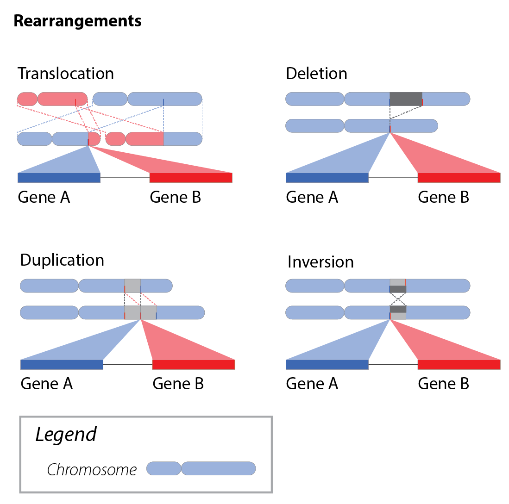

.. role:: opt

Terminology
!!!!!!!!!!!

.. _gene-fusions:

Gene Fusions
@@@@@@@@@@@@
Gene fusions are a complex class of genomic variation that may be characterized by a broad range of relevant attributes with varying specificity.

:opt:`A gene fusion is the joining of two or more genes resulting in a` :ref:`chimeric transcript<chimeric-fusions>` :opt:`and/or an interaction between a rearranged regulatory element of one gene with the expressed product of a partner gene (a` :ref:`regulatory fusion<regulatory-fusions>`\ :opt:`).`

Genetic variations involving :ref:`rearrangements` within the same gene (e.g. internal tandem duplications), and transcript alterations due to splice site variants, have similar structural properties (i.e. novel adjoining :ref:`transcript segments<transcript-segment-component>`) but are not considered gene fusions as they do not involve multiple genes.

Importantly, gene fusions are also distinct from :ref:`rearrangements`, though these concepts are often conflated due to the role of genomic rearrangements in creating gene fusions.

The two primary classes of gene fusions–:ref:`chimeric-fusions` and :ref:`regulatory-fusions`–are not mutually exclusive classes, as some fusions (such as promoter-swap fusions) may be defined either in the context of their regulatory elements or by their chimeric gene product.

Genes that are rearranged resulting in loss of an expressed product do not meet this definitions, and should not be described as gene fusions.

.. _chimeric-fusions:

Chimeric Transcript Fusions
###########################
Chimeric transcript fusions are often driven by genomic rearrangements involving two gene loci, resulting in the concatenation of segments from each into a single transcript.

:opt:`A chimeric transcript is a transcript composed of exons from two or more genes`.

This class of fusions is exemplified by well-known clinically-relevant gene fusions such as BCR(hgnc:1014)::ABL1(hgnc:76). Other clinically-relevant gene fusions of this type may be driven by RNA processing events in lieu of genomic rearrangements. One such event type is read-through transcription (e.g. CTSD(hgnc:2529)::IFITM10(hgnc:40022)) where adjacent genes are transcribed as a single molecule prior to splicing. Another event type is trans-splicing (e.g. JAZF1(hgnc:28917)::JJAZ1(hgnc:17101)), where two distinct transcripts are spliced together during processing. These alternative mechanisms for creating chimeric transcript fusions are described in this specification, but it should be noted that most detected read-through and trans-splicing events are artifactual and/or have little to no known clinical relevance.

.. figure:: images/chimeric-transcripts.png
   :scale: 50%

   Gene fusions typically result in chimeric transcripts between two genes, which (for coding transcripts) often
   result in novel protein sequences. These chimeric transcripts are often caused by DNA rearrangements that bring
   the DNA elements contributing to a gene fusion into close proximity with one another.

.. _regulatory-fusions:

Regulatory Fusions
##################
Regulatory fusions are characterized by the rearrangement of regulatory elements from one gene near a second gene, typically resulting in the increased gene product expression of the second gene. This class of gene fusions include promoter-swapping gene fusions such as reg_p@TMPRSS2(hgnc:11876)::ERG(hgnc:3446), as well as enhancer-driven gene fusions such as reg_e@GATA2(hgnc:4171)::EVI1(hgnc:3498).

:opt:`A regulatory fusion is the interaction of regulatory elements of a gene brought into proximity of a partner gene by` :ref:`genomic rearrangement<rearrangements>`\ :opt:`, modulating gene product expression of the partner gene.`

.. figure:: images/regulatory-fusions.png
   :scale: 50%

   Gene fusions may be regulatory in nature, where a rearranged promoter or nearby enhancer element drives
   overexpression of the partner gene.

.. _fusion-contexts:

Gene Fusion Contexts
@@@@@@@@@@@@@@@@@@@@
Determining the salient elements for a gene fusion is dependent upon the context in which the gene fusion is being described, whether it describes an assayed fusion event from a sample (:ref:`assayed-fusions`) or an aggregate context described in biomedical literature or knowledgebases (:ref:`categorical-fusions`). This specification provide recommendations for characterizing gene fusions in each context.

.. _assayed-fusions:

Assayed Gene Fusions
####################
Assayed gene fusions from biological specimens are directly detected using RNA-based gene fusion assays, or alternatively may be inferred from genomic rearrangements detected by whole genome sequencing or cytogenomic assays in the context of informative phenotypic biomarkers. For example, an EWSR1 fusion is often inferred by breakapart FISH assay when a neoplasm is diagnosed or suspected to be Ewing sarcoma/primitive neuroectodermal tumor by immunohistochemical and/or morphological analysis.

.. _categorical-fusions:

Categorical Gene Fusions
########################
In contrast, categorical gene fusions are generalized concepts representing a class of fusions by their shared attributes, such as retained or lost regulatory elements and/or functional domains, and are typically curated from the biomedical literature for use in genomic knowledgebases. Example categorical gene fusions include:

  - EWSR1 as a known 5' gene fusion partner that joins one of many putative 3' partner genes
  - ALK as a 3' gene fusion partner with a retained kinase domain, which joins one of many putative 5' partner genes
  - The class of BCR::ABL1 fusions involving multiple possible junctions between exons from the constituent BCR and ABL1 transcripts

Related Variant Types
@@@@@@@@@@@@@@@@@@@@@

Gene fusions are closely related to, but distinct from many related types of genomic variation. Those types are described in this
section for contrast, but are not otherwise discussed in the Gene Fusion Guidelines.

.. _rearrangements:

Genomic Rearrangements
######################
Gene fusions are typically driven by DNA rearrangements within the genome. Also known as structural variation, genomic rearrangements can move genetic elements to new locations in the genome, leading to potential gene fusion events. Gene fusions may also be created by post-transcriptional splicing events.

   DNA Rearrangements include translocations, deletions, duplications, and inversions, each of which has the potential to move genes near one another and create gene fusions.

.. _itd:

Internal Tandem Duplications
############################

Internal tandem duplications are repeated transcribed elements within a gene as a result of focal genomic duplications.
Some gene fusion callers also call internal tandem duplications. However, gene fusions are defined by the
interaction between **two or more genes**, therefore internal tandem duplications are not gene fusions and guidelines for
characterizing them are out of scope for this work.
