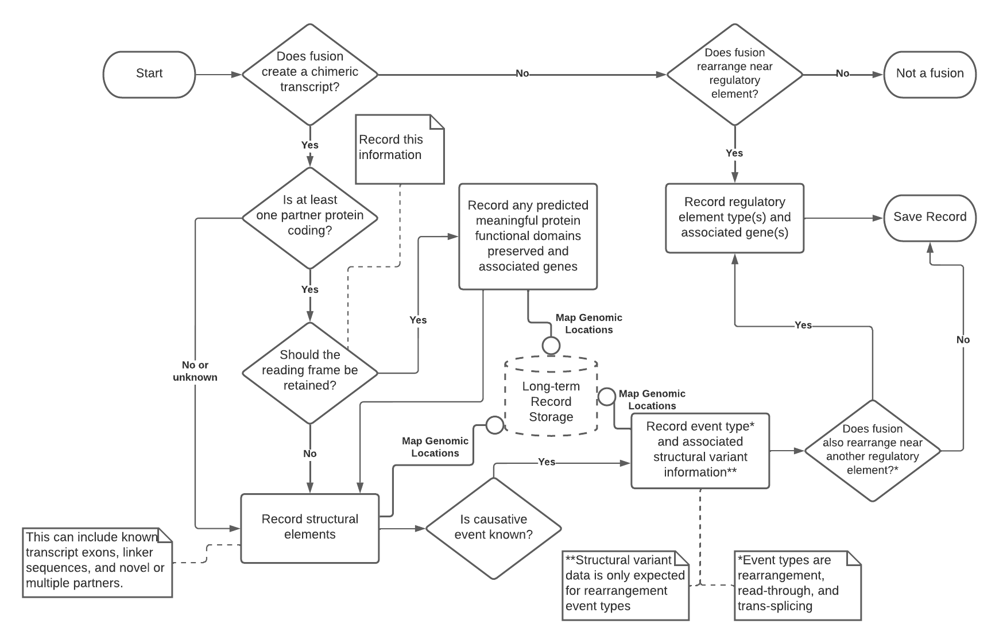

Curation Workflow
!!!!!!!!!!!!!!!!!

   A workflow for the curation of gene fusions

   This is a recommended workflow for the curation of gene fusions from the biomedical literature or for use in
   biomedical knowledgebases.
   Dashed lines indicate notes specific to certain decisions or actions taken in the workflow. Solid lines ending
   in open circles represent automatable tasks using software, such as demonstrated in the
   :ref:`fusion-curation-tool`.